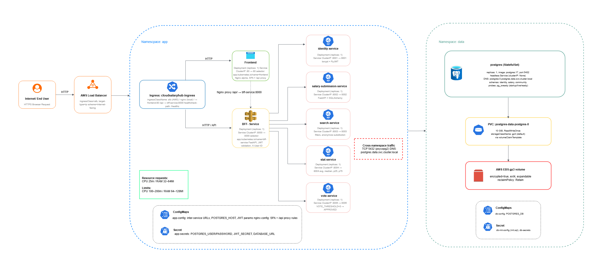

# CloudSalaryHub

A microservices-based salary insights platform built with FastAPI, React, PostgreSQL, and Kubernetes (Minikube for local, EKS for cloud).

## Architecture



> Place your architecture diagram at `docs/architecture.png`.

## Services

| Service | Port | Description |
|---|---|---|
| `frontend` | 3000 | React + Vite + Nginx UI |
| `bff-service` | 8000 | Backend-for-Frontend API gateway |
| `identity-service` | 8001 | Auth, JWT, user management |
| `salary-submission-service` | 8002 | Salary record submissions |
| `search-service` | 8003 | Search across salary data |
| `stat-service` | 8004 | Aggregated statistics |
| `vote-service` | 8005 | Community voting |
| `db` (Postgres 17) | 5432 | Shared database |

---

## Prerequisites

- Docker
- kubectl
- Minikube or microk8s (for local cluster)
- AWS CLI + an AWS account (for the EKS path)

---

## 1. Run Locally on Minikube/Microk8s

### 1.1 Start the cluster

```bash
minikube start
minikube addons enable ingress
minikube addons enable storage-provisioner
```

### 1.2 Build & push images to Docker Hub

```bash
DOCKERHUB_USER=rajithaeyee
TAG=latest

docker build -f identity-service/Dockerfile          -t $DOCKERHUB_USER/cloudsalaryhub-identity-service:$TAG .
docker build -f salary-submission-service/Dockerfile -t $DOCKERHUB_USER/cloudsalaryhub-salary-submission-service:$TAG .
docker build -f search-service/Dockerfile            -t $DOCKERHUB_USER/cloudsalaryhub-search-service:$TAG .
docker build -f stat-service/Dockerfile              -t $DOCKERHUB_USER/cloudsalaryhub-stat-service:$TAG .
docker build -f vote-service/Dockerfile              -t $DOCKERHUB_USER/cloudsalaryhub-vote-service:$TAG .
docker build -f bff-service/Dockerfile               -t $DOCKERHUB_USER/cloudsalaryhub-bff-service:$TAG .
docker build -f frontend/Dockerfile                  -t $DOCKERHUB_USER/cloudsalaryhub-frontend:$TAG ./frontend

for svc in identity-service salary-submission-service search-service stat-service vote-service bff-service frontend; do
  docker push $DOCKERHUB_USER/cloudsalaryhub-$svc:$TAG
done
```

### 1.3 Deploy to the cluster

The repo ships a one-shot script that applies namespaces, all manifests in `k8s/`, restarts deployments, and waits for rollouts:

```bash
./scripts/deploy-local.sh
```

Or run the equivalent steps manually:

```bash
kubectl apply -f k8s/namespace.yaml
kubectl apply -f k8s/
kubectl -n app  rollout status deployment --timeout=300s
kubectl -n data rollout status statefulset/postgres --timeout=300s
```

### 1.4 Access the app

```bash
minikube tunnel              # in a separate terminal
kubectl -n app get ingress
```

Or port-forward the frontend directly:

```bash
kubectl -n app port-forward svc/frontend 3000:80
# open http://localhost:3000
```

### 1.5 Tear down once tested locally

```bash
kubectl delete -f k8s/
minikube stop
```

---

## 2. Deploy to AWS EKS

this project uses AWS Console for infra, GitHub Actions for CI/CD, ECR for images, ALB for ingress.

### 2.1 Create the VPC

- Region: `us-east-1` (substitute your own).
- VPC with CIDR `10.0.0.0/16`, 2 AZs, 2 public + 2 private subnets, 1 NAT gateway, DNS enabled.

### 2.2 Tag the subnets (so EKS / ALB can discover them)

| Tag key | Value | Apply to |
|---|---|---|
| `kubernetes.io/cluster/cloudsalaryhub` | `shared` | all subnets |
| `kubernetes.io/role/elb` | `1` | public subnets only |
| `kubernetes.io/role/internal-elb` | `1` | private subnets only |

### 2.3 Create IAM roles

- **`eks-cluster-role`** — for the EKS control plane (`AmazonEKSClusterPolicy`).
- **`eks-node-role`** — for worker nodes (`AmazonEKSWorkerNodePolicy`, `AmazonEC2ContainerRegistryReadOnly`, `AmazonEKS_CNI_Policy`). Skip on Auto Mode.
- **`gha-cloudsalaryhub-deploy`** — assumed by GitHub Actions via OIDC. Attach `AmazonEC2ContainerRegistryPowerUser` plus an inline policy allowing `eks:DescribeCluster`, `eks:AccessKubernetesApi`, and `ecr:CreateRepository / DescribeRepositories / TagResource`. Trust policy restricted to `repo:<owner>/CloudSalaryHub:*`.

### 2.4 Add the GitHub OIDC provider in IAM

Provider URL `token.actions.githubusercontent.com`, audience `sts.amazonaws.com`.

### 2.5 Create the EKS cluster (Auto Mode recommended)

- Name: `cloudsalaryhub`, latest Kubernetes version.
- Use the VPC + all 4 subnets, public + private endpoint access.
- Auto Mode bundles Karpenter, the EBS CSI driver, and the AWS Load Balancer Controller keep all three capabilities enabled.
- Classic mode alternative: add a managed node group (e.g. 2× `t3.medium` in private subnets) and install the EBS CSI driver + AWS Load Balancer Controller as add-ons. If you go classic, switch `k8s/storageclass.yaml`'s provisioner to `ebs.csi.aws.com` and drop the `IngressClass` document at the top of `k8s/ingress.yaml`.

### 2.6 Grant kubectl access on the cluster

Create EKS **access entries** with policy `AmazonEKSClusterAdminPolicy` for:
- your IAM user (so you can run `kubectl` locally), and
- the `gha-cloudsalaryhub-deploy` role (so GitHub Actions can apply manifests).

### 2.7 Configure GitHub

Repo → **Settings → Secrets and variables → Actions**:

| Secret | Value |
|---|---|
| `AWS_REGION` | `us-east-1` |
| `AWS_ACCOUNT_ID` | your 12-digit account ID |
| `AWS_ROLE_ARN` | ARN of `gha-cloudsalaryhub-deploy` |
| `EKS_CLUSTER_NAME` | `cloudsalaryhub` |

Repo → **Settings → Environments → New environment** → name it `production` (the deploy job uses `environment: production`).

### 2.8 Run the deploy

Push to `master` (or **Actions → CI/CD - Build, Push & Deploy to EKS → Run workflow**). The pipeline:

1. Builds the 7 service images.
2. Creates ECR repos on first run, pushes `:<sha>` and `:latest` tags.
3. Renders `k8s/*.yaml` with `envsubst` (substituting `${ECR_REGISTRY}` and `${IMAGE_TAG}`).
4. Applies manifests, waits for rollouts, prints the ALB DNS.

### 2.9 Open the app

```bash
aws eks update-kubeconfig --name cloudsalaryhub --region us-east-1
kubectl -n app get ingress cloudsalaryhub-ingress \
  -o jsonpath='{.status.loadBalancer.ingress[0].hostname}'
```

Open the printed hostname in a browser.

### 2.10 Tear down

```bash
kubectl delete -f k8s/
```

Then delete the EKS cluster, NAT gateway, and VPC from the AWS Console for stop billing.

